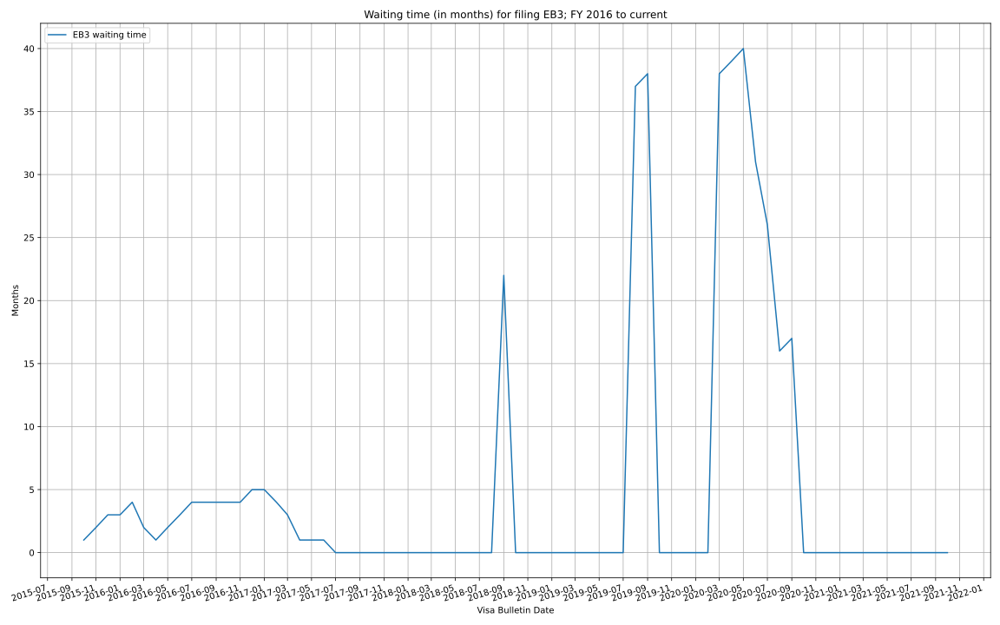

# uscis-visa-bulletin
Extract data from USCIS visa bulletin - https://travel.state.gov/content/travel/en/legal/visa-law0/visa-bulletin.html

We started our analysis from US Government Fiscal Year 2016 onwards, and we
focus on the waiting time for filing an application.  Only EB3 for "All
Chargeability Areas Except Those Listed" are presented here; more can be added
if there's interest in them.

For each bulletin, how many months in the past is the final action date posted
in the Employment-based table?

_Note: familiarity with the visa bulletin jargon and its inner workings is
required to understand this data._

## Employment-based Preference Classes

### EB3 - All Chargeability Areas Except Those Listed

Remarks:
* there was an increase from `C` to `01JAN17` in March 2020;
* it looks likes a similar increase happened also in FY2019 Q4 and FY2018 Q4;
* it's likely that, due to COVID-19 disruption to USCIS operation (USCIS is almost
  completely shut down), this delay is gonna last longer than the past.
